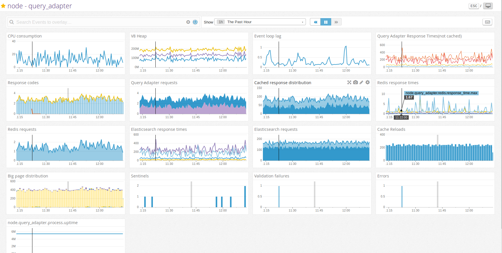

# track stats
The script uses [`hot-shots`](https://github.com/brightcove/hot-shots) a client for StatsD
which is compatible with the customisations in [datadog](http://docs.datadoghq.com/guides/dogstatsd/)

[`pusage`](https://github.com/soyuka/pidusage) is used for getting CPU and memory stats.

## Description
A simple script which will push stats like CPU utilisation, memory and loop lag to datadog.
Rolling average isused for keeping loop lag as accurate as possible.

Just referenceing the file at the start of the app is enough:

```js
const tracker = require('./track_stats');

// some code

// on shutdown
tracker.stop();
```

Config:

```js
const config = {};
// ...
config.sysStatsInterval = 4000;
config.datadog = {
    prefix: 'node.myapp.',
    globalize: true,
    mock: false,
    globalTags: [
        'app:myappquery_adapter', `env:${config.env}`,
        `node.version:${process.version}`, `os.type:${os.type()}`,
        `os.release:${os.release()}`
    ]
};
```

### Dashboard Screenshot
Screenshot of DataDog dashboard built using stats captured in StatsD server

